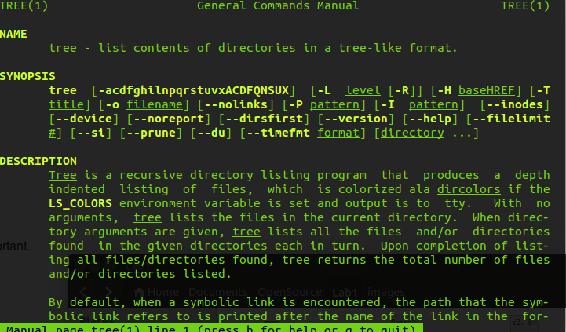

c2. Before asking: give it some time. Sometimes giving your brain a five minute break makes your problem obvious when you sit back down.\\

If the solution doesn't help, try to see where the poster is coming from and see the problem from where he or she is. Then try to fix it again or re-explain the problem.\\

c3. This case is an interesting example of the ethics in the use of technology and the need for technology activism. Though Jesse in no way downloaded pirated files, he unwittingly became a platform for pirates to share files, and hence became the easiest target to be sued. Where precedents for copyright laws have been set for redistribution of physical copyrighted material, the internet opens a whole new battleground for institutions like the RIAA to change the our rights to use technology. This is where the right to tinker in a college environment can be dangerous. Fortunately, activist grougs like the EFF have done well to protect our rights and add new technology freedoms coming into the 21st century. The internet is meant to be free for people to learn and make mistakes without ruining there own lives and this is where great strides are being made in the courts.\\

d3. 
